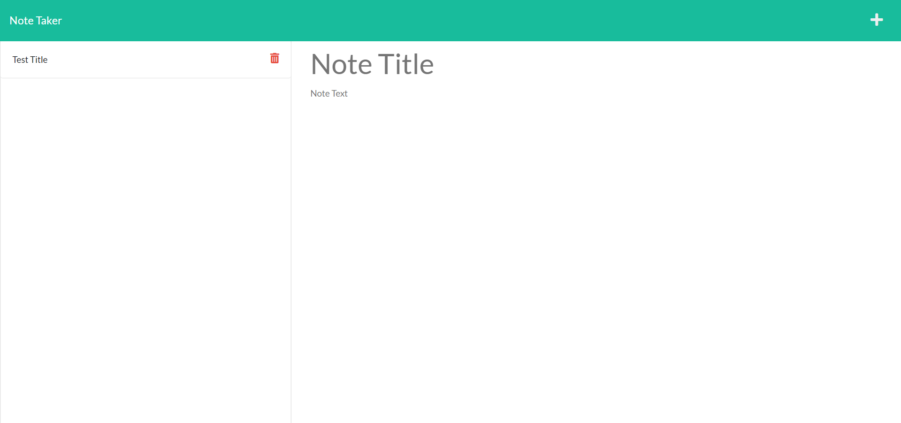
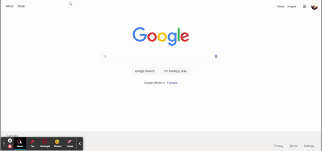

# Note-Taker

  
  ## Description

  A Note Taker Appplication that allows user to write notes and save them.
 
  ## Table of Contents

  * [Installation](#installation)

  * [Usage](#usage)

  * [License](#license)

  * [Questions](#questions)

  
  ## Installation

  npm init your repo and then install the inquirer package

  ## Usage

  * When a user gets to the main landing page, they are displayed with main notes page
  * When user clicks on get start link they are displayed with a page that is split with two columns one for saved notes and one where a note can be created
  * Saved notes are saved by Note tite and can be deleted by clicking on garbage icon.
  * Onces a Note Title and some notes are typed into the field, the right side of screen will display a save icon
  * Clicking on save icon will then display that Note Title as a saved Note on the left side of the page which can be accessed or deleted after

  #### Screenshots
  
  

  #### Demo
  

  ## License
 Licensed under MIT

  ## Questions

  https://github.com/jugrajn

    - Reach me at jugraj.nijjar@gmail.com

